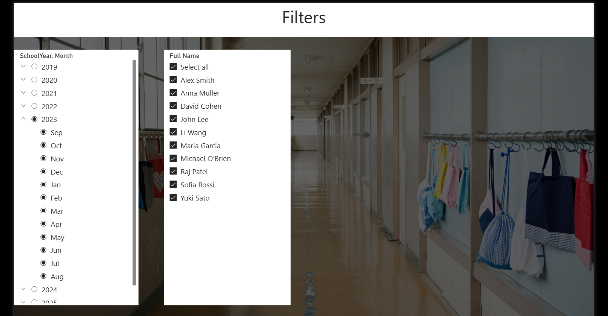

# My Library Report ??

A comprehensive Power BI dashboard for tracking and managing school library book loans at Contoso High School. This interactive report provides real-time insights into loan statuses, student borrowing patterns, and overdue items.

## ?? Features

- **Current Loans Overview**: Monitor all active loans with filtering capabilities
- **Overdue Tracking**: Identify and manage overdue items with customizable day ranges
- **Student Analytics**: Comprehensive view of borrowing patterns by student
- **Interactive Filters**: Advanced filtering by date, student name, and loan status
- **Key Performance Metrics**: Total loans, overdue tracking, YoY comparison, and trends

## ??? Screenshots

### Home Page


### Current Loans Dashboard


### Advanced Filters


### Student Review Analytics


## ?? Getting Started

### Prerequisites
- Power BI Desktop
- Windows 10 or later

### Installation

1. Clone this repository:
   ```bash
   git clone https://github.com/umesha2001/my-library-report.git
   ```

2. Open the report from the `reports` folder

## ?? Project Structure

```
my-library-report/
ÃÄÄ README.md
ÃÄÄ reports/
³   ÀÄÄ library-report.pbix
ÃÄÄ screenshots/
ÀÄÄ documentation/
    ÀÄÄ user-guide.md
```

## ?? Documentation

For detailed usage instructions, see the [User Guide](documentation/user-guide.md).

## ?? Author

**Umesha**
- GitHub: [@umesha2001](https://github.com/umesha2001)

## ?? License

This project is licensed under the MIT License.
