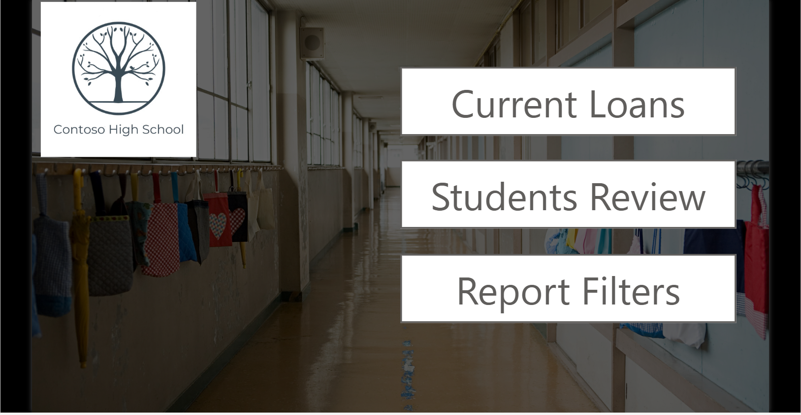
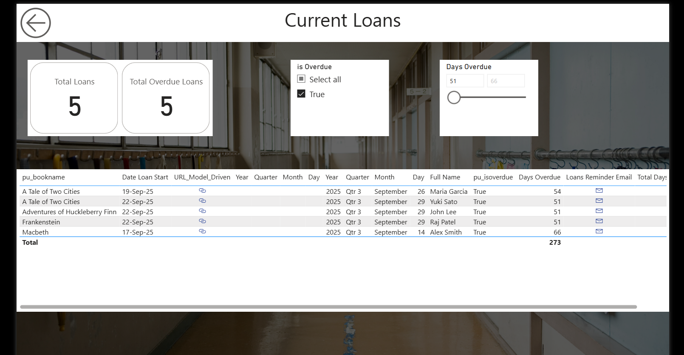
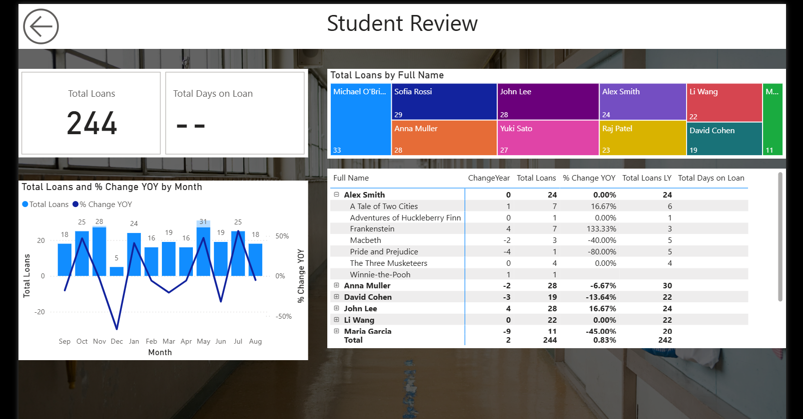

# My Library Report

A Power BI dashboard for tracking and managing school library book loans at Contoso High School.

## 📊 Features

- **Current Loans Overview**: Track active loans and overdue items
- **Student Review**: Analyze borrowing patterns by student
- **Interactive Filters**: Filter by date, student name, and overdue status
- **Key Metrics**: 
  - Total loans and overdue loans
  - Days overdue tracking
  - Year-over-year comparison

## 🖼️ Screenshots

### Home Page


### Current Loans Dashboard


### Student Review Analytics


## 🚀 Getting Started

### Prerequisites
- Power BI Desktop (latest version)
- Access to the library database

### Installation

1. Clone this repository:
```bash
   git clone https://github.com/umesha2001/my-library-report.git
```

2. Open the `.pbix` file in Power BI Desktop:
```
   reports/library-report.pbix
```

3. Refresh data sources as needed

## 📁 Project Structure
```
my-library-report/
├── reports/          # Power BI report files
├── screenshots/      # Dashboard screenshots
└── documentation/   # Additional documentation
```

## 🔧 Configuration

### Data Source Connection
1. Open Power BI Desktop
2. Go to Transform Data > Data Source Settings
3. Update the connection string to your database

### Refresh Schedule
- The report is configured to refresh daily at 6:00 AM
- Manual refresh can be triggered from Power BI Service

## 📈 Report Pages

1. **Home**: Navigation hub with quick access to all reports
2. **Current Loans**: Real-time view of active loans
3. **Student Review**: Detailed student borrowing analytics
4. **Report Filters**: Advanced filtering capabilities

## 🤝 Contributing

Contributions are welcome! Please feel free to submit a Pull Request.

1. Fork the repository
2. Create your feature branch (`git checkout -b feature/AmazingFeature`)
3. Commit your changes (`git commit -m 'Add some AmazingFeature'`)
4. Push to the branch (`git push origin feature/AmazingFeature`)
5. Open a Pull Request

## 📝 License

This project is licensed under the MIT License - see the LICENSE file for details.

## 👤 Author

**Umesha**
- GitHub: [@umesha2001](https://github.com/umesha2001)

## 🙏 Acknowledgments

- Contoso High School Library Team
- Power BI Community

## 📞 Support

For support, email your-email@example.com or open an issue in this repository.

---

**Note**: This report contains sample data for demonstration purposes.
```

### 3. **Add a .gitignore File**

Create a `.gitignore` file to exclude unnecessary files:
```
# Power BI
*.pbix.tmp


